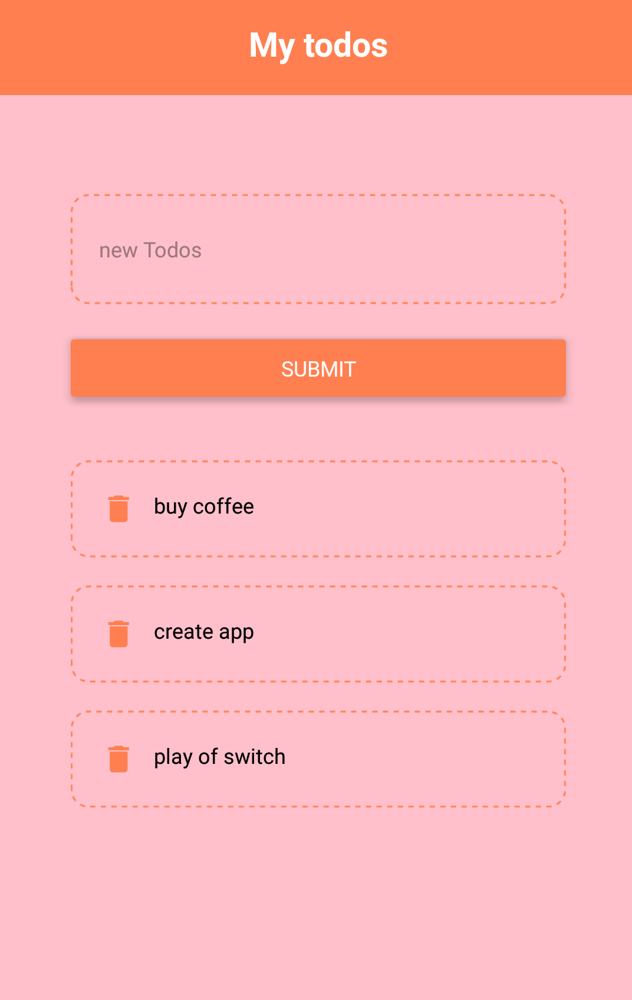

<h2 style="color:greenyellow">About Project</h2>

This is a simple reactnative project.In this project I added features like
<ul><li>Add data</li>
  <li>delete data</li></ul>

 
 
<h3>Built With
</h3>
<ul><li>React-Native</li><li>JavaScript</li></ul>

In bellow i added some screenshots in this project

